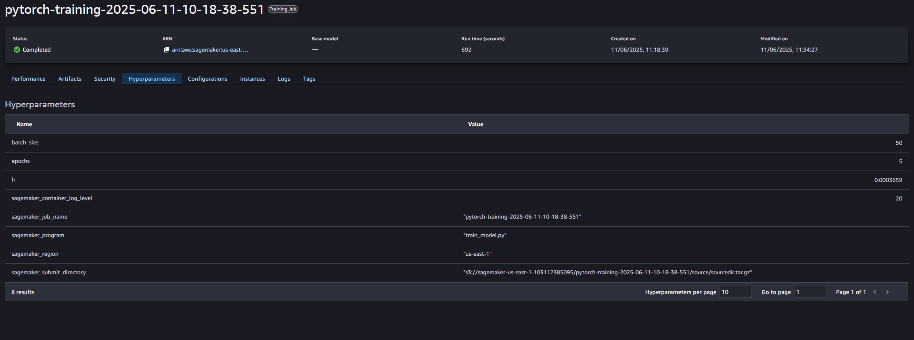
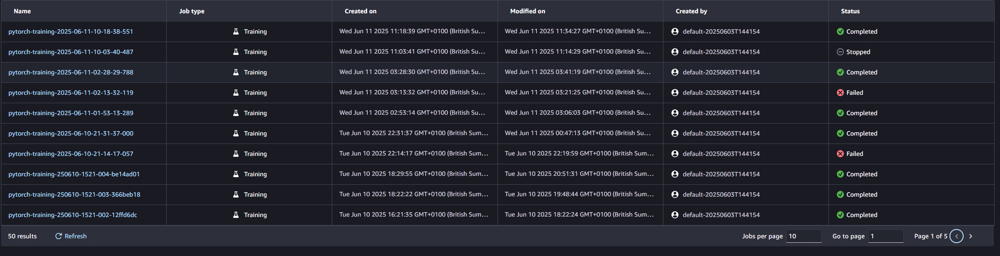
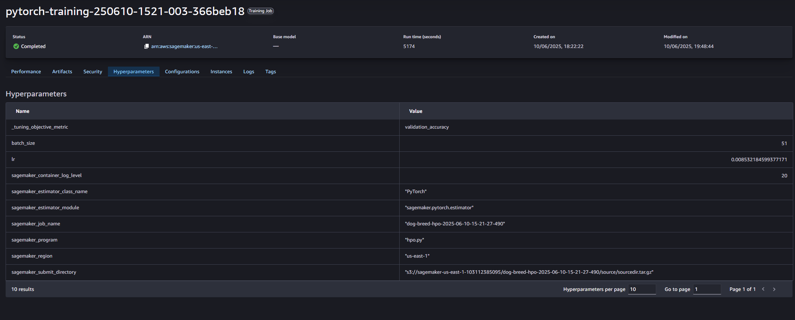
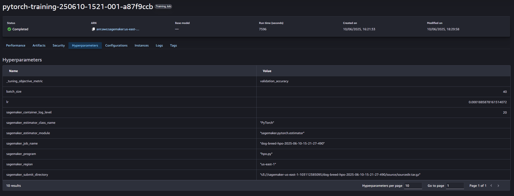
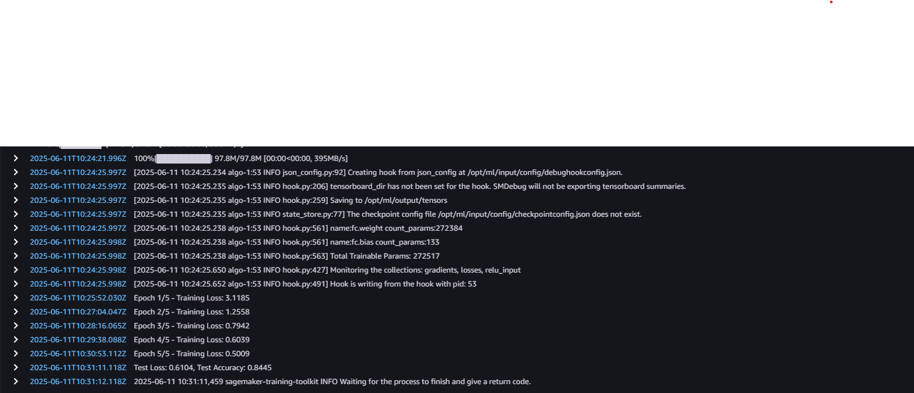
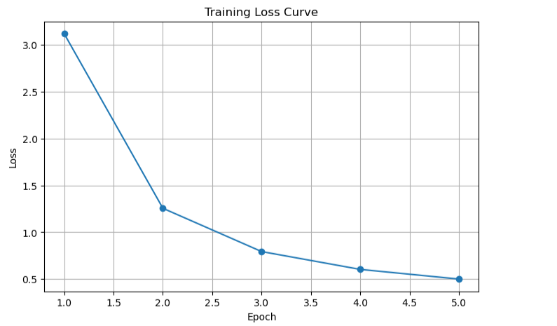
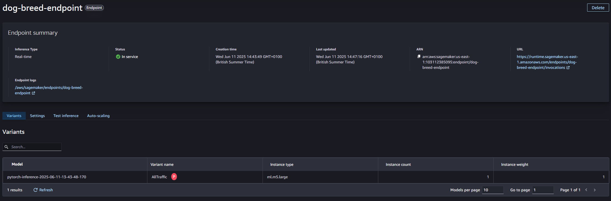

# Image Classification using AWS SageMaker

Use AWS Sagemaker to train a pretrained model that can perform image classification by using the Sagemaker profiling, debugger, hyperparameter tuning and other good ML engineering practices. This is done on the provided dog breed classification data set.

## Project Set Up and Installation
Enter AWS through the gateway in the course and open SageMaker Studio. 
Download the starter files.
Download/Make the dataset available. 

## Dataset
The dataset used for this project is the Dog Breed Classification Dataset provided in the course materials.
The dataset consists of images of 133 dog breeds organized into separate directories for training, validation, and testing.
The data was uploaded to my personal S3 bucket and used as input for all training jobs.

### Access
Upload the data to an S3 bucket through the AWS Gateway so that SageMaker has access to the data. 

## Hyperparameter Tuning
For this experiment, I used a pretrained ResNet50 model from torchvision.models, leveraging transfer learning by freezing the pretrained layers and only fine-tuning the final fully connected layer to adapt to the 133 dog breed classes.

Hyperparameters tuned: Learning Rate (lr) and Batch Size (batch_size)

I used SageMaker’s built-in Hyperparameter Tuner to automatically find the best hyperparameters. The objective metric was validation_accuracy extracted from logs during training：

The best hyperparameters were successfully retrieved after running multiple training jobs：
best_batch_size = 50
best_lr = 0.0003659

## Debugging and Profiling
SageMaker Debugger and Profiler were enabled in my training job to monitor training behavior and system resource usage.

Debugging:
I integrated the smdebug library into my training code by registering the Hook and properly setting hook modes during training and evaluation. Loss values and training metrics were recorded and monitored.
When visualization with smdebug was problematic, I extracted loss values from CloudWatch logs and successfully plotted the loss curve using the following pattern:

Epoch 1/5 - Training Loss: 3.1185
Epoch 2/5 - Training Loss: 1.2558
Epoch 3/5 - Training Loss: 0.7942
Epoch 4/5 - Training Loss: 0.6039
Epoch 5/5 - Training Loss: 0.5009

Profiling:
SageMaker Profiler was enabled. Due to the small model and limited instance, system utilization remained low. No major CPU, GPU, memory, or IO bottlenecks were detected. Due to resource constraints, I wasn't able to generate the full profiler html/pdf output. I have

### Results
The model successfully trained with an accuracy around 84% on the test set. 

Debugging and profiling confirmed no signs of vanishing gradients, overfitting, or resource issues.

Early stopping logic was also included to prevent unnecessary training epochs.

## Model Deployment
The best trained model was deployed to a real-time SageMaker endpoint, and the deployed model successfully accepted images as input using binary payloads (application/x-image).

code piece: 
from sagemaker.serializers import IdentitySerializer
from sagemaker.deserializers import JSONDeserializer

predictor = pytorch_model.deploy(
    initial_instance_count=1,
    instance_type="ml.m5.large",
    endpoint_name="dog-breed-endpoint"
)

predictor.serializer = IdentitySerializer(content_type="application/x-image")
predictor.deserializer = JSONDeserializer()

with open("German_shepherd_dog_04931.jpg", "rb") as f:
    payload = f.read()
response = predictor.predict(payload)
print(response)

As shown above, a sample prediction was made on a German Shepherd Dog image, 

The model response is: {'predicted_class': 70}. Mapping 70 back to class index confirmed the prediction matched the correct breed

Another try is given to:

which has a response of {'predicted_class': 75}. Mapping 75 back to class index confirmed this correct prediction result.

